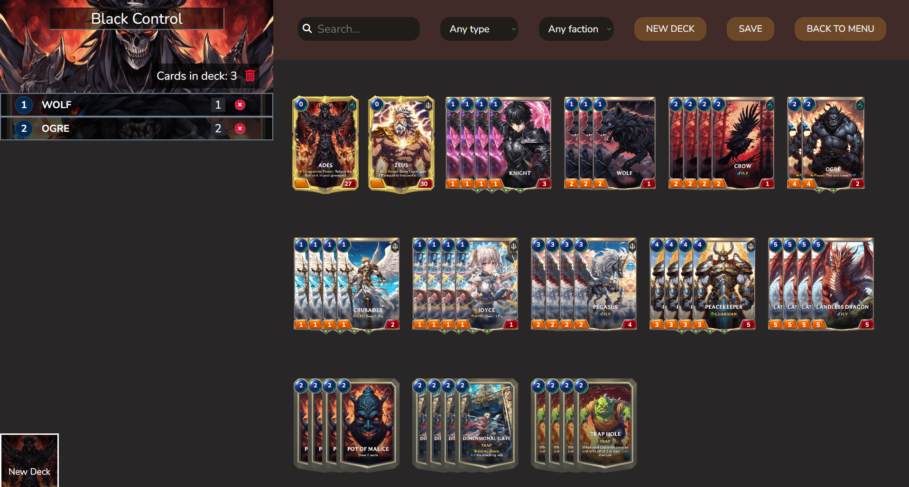
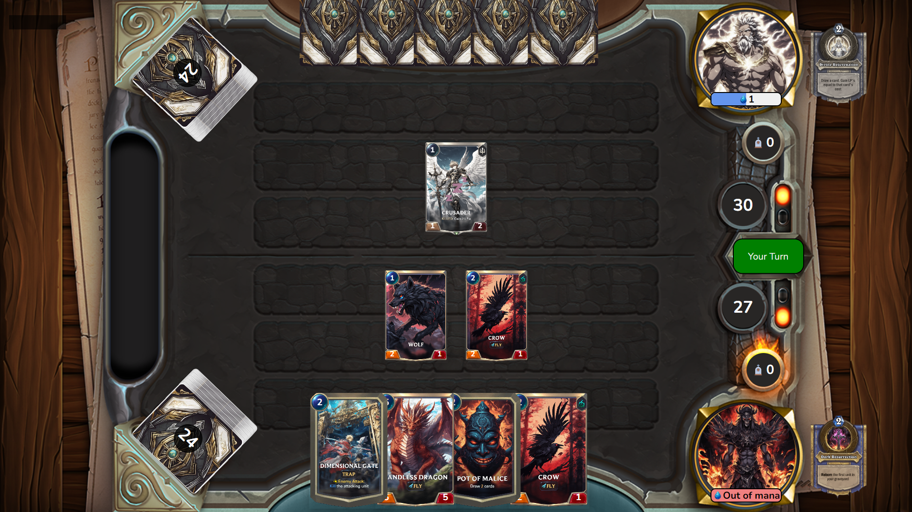

# Pantheon Wars

## Screenshots




## Introduction

Hello everyone, I'm Alessandro, and I'm a timeless TCG enthusiast, therefore it was natural for me to combine 2 passions of mine and try to make an online browser TCG game of my own. The game currently features a pool of about 100 cards (at the moment, either White, Black or colorless) which you can aquire with gold or crystlas you will obtain by challenging your friends in online battles. 
The game is still in an early developement phase, so feel free to reach out for ideas, feedbacks or bug reports.

## Current known bugs (Apologies, working on it)

- **Hand disappear on turn one**, forces page refresh and game to start over

## How to Play

### Play Online

You can play the game online by visiting the deploy link over Netlify: [Pantheon Wars](https://pantheonwars.netlify.app/#/).

### Play Locally

To play the game locally, follow these steps:

1. **Clone the Repository**: Clone the project repository from GitHub to your local machine. Open your terminal and run the following command:

  ```bash
git clone https://github.com/AlessandroCampo/tcg-vite.git
```


2. **Navigate to the Project Directory**: Change your current directory to the cloned project directory:

```bash
npm install
```

3. **Start the game**: Once the dependencies are installed, you can start the game by running:
```bash
npm run dev
```
then open your web browser and navigate to the suggested localhost

### How to play

In order to start a game, you need an active deck with at least 25 cards. The starter pack bundle contains enough cards to build a basic list for either Zeus or Ades (Black and White commanders).
After building one in the deck building page, join the queue in the main menu page and wait for the matchmaking to find another player in queue at the same time.
Inside the game, every effect is automatic and you can play cards or attack by simply drag and dropping. (Drag on enemy commander avatar image for direct attacks).
Whatever player brings the opposing commander HP to 0 first wins.


## Game Glossario

- **Commander**, the commander is the main card of the deck, limits the card you can use to match his color, and its the target of direct attacks. Each commander has unique turn power and hps.
- **Unit**, are all the cards that can attack, equal to minions for HS or creatures for Magic
- **Spell**, spell cards can only be played in your own turn
- **Traps**, trap cards dont activate immediatly after being plyed, but they will only activate when their trigger condition is met, after being played.
- **Taunt** units with taunt will force you to attack themselves, or another unit with taunt.
- **Rush**, unlike other units, a unit with rush can attack the turn its played.
- **Fly**, same as rush, fly units can attack on the turn they're played, but they can also ignore taunt from enemy units.
-  **Lifesteal**, when attacking with a lifesteal unit, your commander will gain HP's equal to the damage  you have dealt.
- **Transform** at the start of the turn, after turns have  passed equal to the amount indicated on the card, the transform unit will be replaced by the corresponding evolution card.


